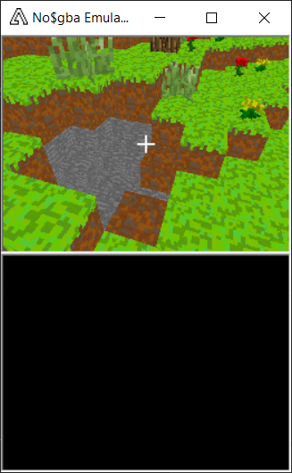
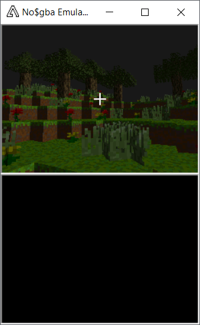
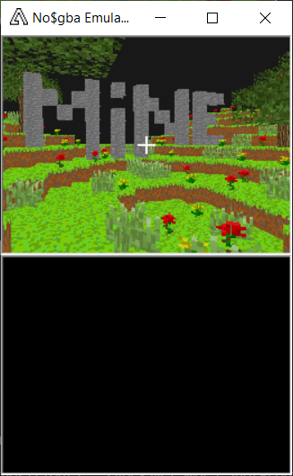

# Minecraft_DS
Classic Minecraft for the game console Nintendo DS implemented with help of the devkitPro Toolchain.
To play simply download the *.nds file and run it with an emulator like no$gba.

# Disclaimer
Not Minecraft, just pseudo-randomly generated terrain, some collision and block destruction.

# Features already implemented
  - World generation (used with own implementation of two dimensional Perlin Noise based on Dave Mount & Roger Eastman's CMSC 425 Lecture 13)
  - Camera (inspired by Joey de Vries's tutorial from learnopengl.com)
  - Block destruction
 
# Shots from the game

   

# Features to implement:
  - Rendering optimization
  - Placing blocks
  - World generation refinement (stones, ores, caves etc.)
  - Water
  - Day and Night cycle
  - Lighting
  - Monsters
  - So much more
